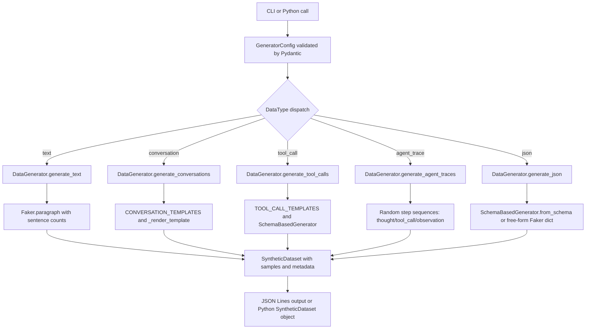

# aumai-datasynthesizer

Generate synthetic training data for AI agent testing. Create realistic conversations, tool calls, agent execution traces, and schema-conformant JSON records — all from a single command, with optional reproducible seeding.

[](https://github.com/aumai/aumai-datasynthesizer/actions)
[](https://pypi.org/project/aumai-datasynthesizer/)
[](LICENSE)
[](https://python.org)

Part of the [AumAI](https://github.com/aumai) open-source agentic infrastructure suite.

---

## What is this?

When building and testing an AI agent you need lots of realistic data: example conversations, plausible tool calls with sensible arguments, realistic failure modes, edge cases. Collecting real data is slow, expensive, and raises privacy concerns. Writing fake data by hand does not scale.

`aumai-datasynthesizer` is a synthetic data factory. Tell it what kind of data you need, how many samples, and optionally a random seed for reproducibility. It outputs JSON Lines files you can feed directly into training pipelines, evaluation harnesses, or load tests.

Think of it like a realistic traffic generator for your agent — the way network engineers use tools like `iperf` to stress-test infrastructure without needing real users.

---

## Why does this matter?

### The problem: data starvation in early development

Most agent development projects hit the same wall: before you have real users you have no data, but without data you cannot properly test or fine-tune your agent. This creates a catch-22:

- Unit tests catch logic errors but cannot reveal emergent failures across diverse inputs.
- Manual test case authoring is slow and biased toward the happy path.
- Using production data for testing raises compliance and privacy issues.

### The first-principles solution

Agent behaviour is entirely determined by its inputs: the shape and content of messages, tool call arguments, and conversation context. If you can faithfully simulate the distribution of those inputs — even with a lightweight statistical model — you can:

1. Test the agent against hundreds of realistic scenarios automatically.
2. Reproduce failure modes deterministically by fixing the random seed.
3. Generate labelled training examples for fine-tuning without using real user data.

`aumai-datasynthesizer` uses [Faker](https://faker.readthedocs.io) to fill conversation templates with realistic values (names, emails, dates, order IDs) and a built-in JSON Schema generator to produce structurally valid records for any schema you define.

---

## Architecture



**Key components:**

| Component | Role |
|---|---|
| `DataType` | Enum of supported types: `text`, `json`, `conversation`, `tool_call`, `agent_trace` |
| `GeneratorConfig` | Validated generation parameters: type, count, seed, schema, constraints |
| `ConversationTurn` | Single turn: role, content, optional tool_calls list |
| `SyntheticDataset` | Output envelope: config, list of sample dicts, metadata dict |
| `DataGenerator` | Main dispatcher — routes config to the correct generation method |
| `SchemaBasedGenerator` | Generates dicts conforming to a JSON Schema object/string/integer/boolean/array subset |
| `CONVERSATION_TEMPLATES` | Built-in multi-turn templates: customer support, code assistant, research assistant |
| `TOOL_CALL_TEMPLATES` | Built-in tool call schemas: web search, email, database, file operations |

---

## Features

- **Five data types** — text paragraphs, JSON objects, multi-turn conversations, tool call dicts, and agent execution traces.
- **Reproducible output** — set `--seed` (or `config.seed`) to get the identical dataset every time. Essential for regression testing.
- **JSON Schema support** — pass any JSON Schema file and the generator produces structurally correct records with `enum`, `format`, `minimum`/`maximum`, and `array` constraints.
- **Built-in templates** — three conversation templates and four tool-call schemas ship out of the box, with realistic Faker-generated values in every placeholder.
- **Constraint overrides** — pass `--constraint key=value` pairs to customise generation per run without code changes.
- **JSON Lines output** — one record per line; compatible with most ML training pipelines and streaming ingestors.
- **Metadata envelope** — every `SyntheticDataset` includes generation time, sample count, and data type in a `metadata` dict.
- **Faker-powered realism** — real-looking names, emails, dates, sentences, and domain values from the mature Faker library.

---

## Quick Start

### Install

```bash
pip install aumai-datasynthesizer
```

### Generate data in under 5 minutes

**Generate 20 customer support conversations:**

```bash
aumai-datasynthesizer generate --type conversation --count 20 --seed 42 \
  --output conversations.jsonl
# Generated 20 conversation samples in 12.4 ms.
# Output written to: conversations.jsonl
```

**Generate 50 web-search tool calls:**

```bash
aumai-datasynthesizer generate --type tool_call --count 50 \
  --constraint tool=search --output tool_calls.jsonl
```

**Generate 100 JSON records from a custom schema:**

```bash
cat > user_schema.json <<'EOF'
{
  "type": "object",
  "properties": {
    "id":     { "type": "string", "format": "uuid" },
    "email":  { "type": "string", "format": "email" },
    "age":    { "type": "integer", "minimum": 18, "maximum": 90 },
    "active": { "type": "boolean" }
  },
  "required": ["id", "email", "age"]
}
EOF

aumai-datasynthesizer generate --type json --count 100 \
  --schema user_schema.json --seed 0 --output users.jsonl
```

**List all available built-in templates:**

```bash
aumai-datasynthesizer templates --list
```

---

## CLI Reference

### `aumai-datasynthesizer generate`

Generate synthetic data samples and write them as JSON Lines.

```
Usage: aumai-datasynthesizer generate [OPTIONS]

Options:
  --type [text|json|conversation|tool_call|agent_trace]
                          Type of data to generate.  [required]
  --count INTEGER RANGE   Number of samples to generate.  [default: 10]
  --seed INTEGER          Random seed for reproducible output.
  --output PATH           Output file (.jsonl or .json). Use '-' for stdout.
                          [default: -]
  --schema PATH           Path to a JSON Schema file (used with --type json).
  --constraint KEY=VALUE  Constraint as KEY=VALUE pair. Repeatable.
  --help
```

**Constraint keys by data type:**

| `--type` | Constraint key | Valid values | Default |
|---|---|---|---|
| `text` | `min_sentences` | positive integer | `1` |
| `text` | `max_sentences` | positive integer | `5` |
| `conversation` | `template` | `customer_support`, `code_assistant`, `research_assistant` | `customer_support` |
| `tool_call` | `tool` | `search`, `email`, `database`, `file_operations` | `search` |

**Examples:**

```bash
# Code assistant conversations, 10 samples, reproducible
aumai-datasynthesizer generate --type conversation --count 10 \
  --constraint template=code_assistant --seed 1

# Dense text paragraphs (5-10 sentences each)
aumai-datasynthesizer generate --type text --count 30 \
  --constraint min_sentences=5 --constraint max_sentences=10

# Agent execution traces printed to stdout
aumai-datasynthesizer generate --type agent_trace --count 5

# Schema-driven JSON to a file
aumai-datasynthesizer generate --type json --count 200 \
  --schema ./schemas/order.json --seed 99 --output orders.jsonl
```

---

### `aumai-datasynthesizer templates`

List available conversation and tool-call templates.

```
Usage: aumai-datasynthesizer templates [OPTIONS]

Options:
  --list                              List all available built-in templates.
  --category [conversation|tool_call] Filter templates by category.
  --help
```

**Examples:**

```bash
# Show everything
aumai-datasynthesizer templates --list

# Only conversation templates
aumai-datasynthesizer templates --category conversation

# Only tool-call templates
aumai-datasynthesizer templates --category tool_call
```

---

## Python API Examples

### Generate text samples

```python
from aumai_datasynthesizer import DataGenerator, GeneratorConfig, DataType

generator = DataGenerator()

config = GeneratorConfig(
    data_type=DataType.text,
    count=20,
    seed=42,
    constraints={"min_sentences": 2, "max_sentences": 6},
)
dataset = generator.generate(config)
for sample in dataset.samples[:3]:
    print(sample["text"])
print(dataset.metadata)
# {'generated_count': 20, 'generation_time_ms': 3.2, 'data_type': 'text'}
```

### Generate multi-turn conversations

```python
config = GeneratorConfig(
    data_type=DataType.conversation,
    count=5,
    seed=0,
    constraints={"template": "code_assistant"},
)
dataset = generator.generate(config)
for sample in dataset.samples:
    for turn in sample["turns"]:
        print(f"[{turn['role']}] {turn['content'][:80]}")
    print("---")
```

### Generate tool calls

```python
config = GeneratorConfig(
    data_type=DataType.tool_call,
    count=10,
    constraints={"tool": "email"},
)
dataset = generator.generate(config)
for sample in dataset.samples:
    print(sample["function"]["name"])
    print(sample["function"]["arguments"])
```

### Generate agent execution traces

```python
config = GeneratorConfig(data_type=DataType.agent_trace, count=3, seed=7)
dataset = generator.generate(config)
for trace in dataset.samples:
    steps = trace["steps"]
    print(f"Trace {trace['trace_id']}: {len(steps)} steps, success={trace['success']}")
    for step in steps:
        print(f"  step {step['step']} [{step['type']}]")
```

### Generate JSON from a schema

```python
schema = {
    "type": "object",
    "properties": {
        "user_id": {"type": "string", "format": "uuid"},
        "score":   {"type": "number", "minimum": 0.0, "maximum": 100.0},
        "tier":    {"type": "string", "enum": ["free", "pro", "enterprise"]},
        "tags":    {"type": "array", "items": {"type": "string"}, "minItems": 1, "maxItems": 4},
    },
    "required": ["user_id", "score", "tier"],
}

config = GeneratorConfig(
    data_type=DataType.json,
    count=50,
    schema=schema,
    seed=1,
)
dataset = generator.generate(config)
print(dataset.samples[0])
```

### Use SchemaBasedGenerator directly

```python
from faker import Faker
from aumai_datasynthesizer import SchemaBasedGenerator

gen = SchemaBasedGenerator(faker=Faker())

records = gen.from_schema(
    schema={
        "type": "object",
        "properties": {
            "name":   {"type": "string"},
            "count":  {"type": "integer", "minimum": 1, "maximum": 10},
            "active": {"type": "boolean"},
        },
        "required": ["name", "count"],
    },
    count=5,
)
for record in records:
    print(record)
```

### Call type-specific generators directly

```python
# Generate only the raw conversation turn lists, without the dataset envelope
conversations = generator.generate_conversations(config)
for turns in conversations:
    for turn in turns:
        print(turn.role, turn.content[:60])
```

---

## Configuration

`GeneratorConfig` fields:

| Field | Type | Description | Default |
|---|---|---|---|
| `data_type` | `DataType` | One of `text`, `json`, `conversation`, `tool_call`, `agent_trace` | required |
| `count` | `int` | Number of samples to generate (must be > 0) | `10` |
| `seed` | `int \| None` | Integer seed for `Faker` and `random`; `None` for non-deterministic output | `None` |
| `schema` | `dict \| None` | JSON Schema dict used when `data_type=DataType.json` | `None` |
| `constraints` | `dict` | Free-form type-specific overrides (see constraint key table above) | `{}` |

All fields are validated by Pydantic v2 at construction time.

---

## Built-in Templates

### Conversation templates

| Name | Turns | Topic |
|---|---|---|
| `customer_support` | 7 | User inquires about an e-commerce order; agent provides tracking information |
| `code_assistant` | 5 | User asks how to implement a Python pattern; follow-up on performance at scale |
| `research_assistant` | 5 | User requests an academic paper summary and methodology details |

All templates use `{placeholder}` tokens resolved by Faker at generation time — each generated conversation gets unique names, emails, order IDs, dates, and sentences. The same template produces a different conversation on every call unless `seed` is fixed.

### Tool-call templates

| Name | Function name | Key parameters |
|---|---|---|
| `search` | `web_search` | `query` (required), `num_results`, `safe_search` |
| `email` | `send_email` | `to` (required), `subject` (required), `body` (required), `cc` |
| `database` | `execute_query` | `query` (required), `params`, `database` |
| `file_operations` | `file_operation` | `operation` enum (required), `path` (required), `content`, `encoding` |

---

## How it works — technical deep-dive

### Template rendering

Conversation templates contain `{placeholder}` tokens. `_render_template()` uses a compiled regex (`r"\{(\w+)\}"`) to locate all placeholders and resolve them via `_FAKER_ATTR_MAP`, which maps each placeholder name to a Faker method name. Unknown placeholders fall back to `faker.word()`.

### SchemaBasedGenerator

`_generate_value()` recursively dispatches on the `"type"` field of a JSON Schema node:

- `"string"` — honours `enum`, `format: email/date/uri/uuid`, or falls back to `faker.sentence(nb_words=4)`.
- `"integer"` — `faker.random_int(min=minimum, max=maximum)` with schema `minimum`/`maximum` bounds.
- `"number"` — `random.uniform(minimum, maximum)` rounded to 4 decimal places.
- `"boolean"` — `faker.boolean()`.
- `"array"` — generates between `minItems` and `maxItems` elements by recursing into `items`.
- `"object"` — iterates over `properties`; required fields are always generated; optional fields are included with 80% probability.
- `"null"` — returns `None`.

### Agent trace generation

Each trace contains 2–6 steps sampled from three step types: `thought`, `tool_call`, `observation`. Tool-call steps choose a random tool from `TOOL_CALL_TEMPLATES`. Timestamps advance by a random delay between 0.1 and 2.0 seconds per step. 80% of traces are marked as `success=True`.

### Reproducibility

Setting `seed` calls `Faker.seed(seed)` and `random.seed(seed)` before any generation work. Because Faker uses a global seed in CPython, all instances within a single process will produce deterministic output when the seed is fixed.

---

## Integration with other AumAI projects

| Project | How it connects |
|---|---|
| `aumai-toolretrieval` | Generate synthetic `ToolRecord`-shaped JSON objects in bulk to populate a test tool registry; benchmark retrieval accuracy under large-scale conditions. |
| `aumai-costprov` | Generate synthetic `CostEntry` records to unit-test budget enforcement logic and reporting without spending real money on LLM calls. |
| `aumai-specs` | Generate conversation and tool-call datasets that match your formal agent specs; run spec-driven conformance tests against the generated samples. |

---

## Contributing

Adding a new template is the easiest contribution:

1. Add an entry to `CONVERSATION_TEMPLATES` or `TOOL_CALL_TEMPLATES` in `templates.py`.
2. Add any new `{placeholder}` keys to `_FAKER_ATTR_MAP` in `core.py`.
3. Add a test that generates 10 samples from your template with `seed=0` and asserts the result is non-empty and structurally correct.

For new data types, extend the `DataType` enum and add a generator method plus the corresponding dispatch branch in `DataGenerator.generate()`.

Please read `CONTRIBUTING.md` for the full coding standards and PR guidelines.

---

## License

Apache 2.0. See [LICENSE](LICENSE).

---

Part of [AumAI](https://github.com/aumai) — open-source infrastructure for the agentic AI era.
